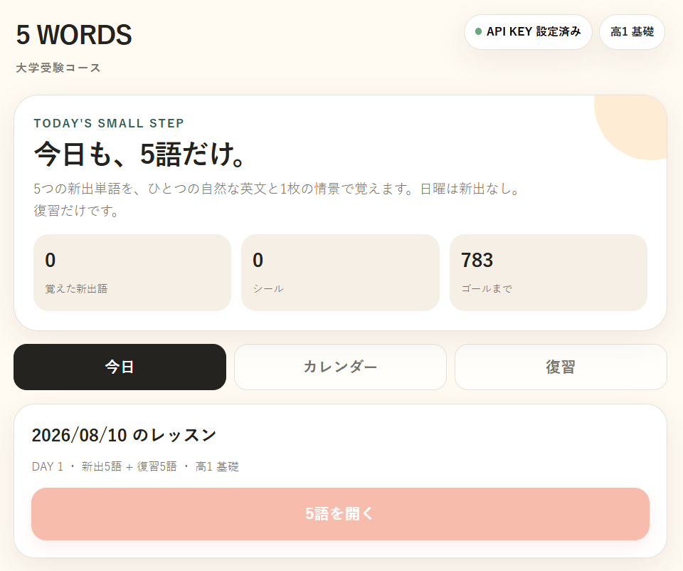

# 5 WORDS — 大学受験

**1日5語だけ。3年間、少しずつ。**

高校1年生から大学受験まで、毎日少量の英単語を積み上げるための英語学習PWAです。
AIがその日の新出5語を選び、**5語すべてを使った自然な英文**と、英文の内容を記憶しやすくする**1枚の情景画像**を生成します。



## Concept

大量の単語を一度に詰め込むのではなく、毎日5語だけ新しく覚えます。

- 月〜土：**新出5語 + 復習5語**
- 日曜：**新出なし + 復習10語**
- 初日 2026-08-09 は日曜でも **DAY 1 / 新出5語**
- 学習完了でカレンダーに**シール**
- 過去の未学習日は後から埋められる
- 学習完了した単語は**覚えた単語一覧**へ自動追加
- 一覧の単語だけを使った**ランダムテスト**に対応
- 高1基礎 → 高2標準 → 高3実戦へ段階的に難化
- 学習期間：**2026-08-09 〜 2028-09-30**
- 最大 **3,365語**の新出語を学習

「連続記録を切らさないこと」よりも、**学習した日がカレンダーに少しずつ増えていくこと**を大切にしています。

## Features

### 1. 1日5語
大学受験の英文読解で役立つ語彙を、現在の学習段階に合わせてAIが5語選びます。
既出語は記録し、同じ単語をできるだけ再び新出語として選ばないようにします。

### 2. 5語を1つの自然な英文に
5語を単独で覚えるだけではなく、5語すべてを通常の意味で使った、大学受験レベルの自然な英文を1文生成します。

### 3. 英文を1枚の画像に
英文の場面をAI画像として生成します。

**5 words → 1 sentence → 1 scene**

単語・文脈・視覚イメージを結び付けて記憶することを狙っています。

### 4. 新出 + 復習クイズ
通常日は新出5語と過去の5語を組み合わせて復習します。
初日は過去語がないため、新出5語のみで開始します。

### 5. カレンダーにシール
その日の学習を終えるとカレンダーにシールが付きます。
空白になった過去の日も、後から学習して埋めることができます。

### 6. 覚えた単語一覧 + 一覧テスト
学習を完了した日の単語だけを一覧表示します。

- 英単語
- 品詞
- 日本語の意味
- 学習メモ
- 覚えた日
- 単語・意味から検索

一覧から最大10語をランダムに選び、**英語 → 日本語**と**日本語 → 英語**を交互に出題できます。
検索中は、画面に表示されている単語だけがテスト対象になります。

## BYOK — Bring Your Own Key

このアプリは **BYOK方式**です。
利用者自身のOpenAI APIキーを、アプリ右上の **API KEY** から設定します。

- APIキーをGitHubのソースコードに埋め込みません
- Cloudflare Pagesの `OPENAI_API_KEY` Secretも不要です
- APIキーは利用端末のブラウザ `localStorage` に保存されます
- API呼び出し時のみ、同一サイトのPages Functionを経由してOpenAI APIへ送信します
- Pages FunctionはAPIキーを永続保存しません
- API利用料金は、入力したOpenAI APIキーのアカウントに発生します

### 使用モデル

- 教材生成：`gpt-5-mini` / Responses API
- 画像生成：`gpt-image-2` / Image API
- 画像：1024 × 1024 / WebP

## Data storage

端末側に保存します。

- 学習履歴
- 生成済み教材
- シール
- 覚えた単語一覧の元データ
- 一覧テスト履歴
- APIキー

上記は `localStorage`、生成画像は Cache Storage を利用します。
ブラウザのサイトデータを削除すると、これらのデータも削除されます。

## Deploy to Cloudflare Pages

### 1. Clone / Download

このリポジトリをローカルに用意します。

### 2. Cloudflare Pages project

テスト用プロジェクトを新規作成する場合：

```powershell
npx wrangler pages project create five-words-test --production-branch main
```

### 3. Deploy

```powershell
npx wrangler pages deploy . --project-name five-words-test --branch main
```

または同梱の `deploy.ps1` を実行します。

> BYOK方式なので `wrangler pages secret put OPENAI_API_KEY` は必要ありません。

## Files

```text
.
├─ index.html
├─ styles.css
├─ app-core.js
├─ app-lesson.js
├─ app-calendar.js
├─ app-learned.js
├─ manifest.webmanifest
├─ sw.js
├─ deploy.ps1
├─ functions/
│  └─ api/
│     ├─ generate.js
│     └─ image.js
├─ icons/
│  ├─ icon-192.png
│  └─ icon-512.png
└─ screenshot1.png
```

## Version

**v0.1.3 BYOK**

Current curriculum start date: **2026-08-09**
